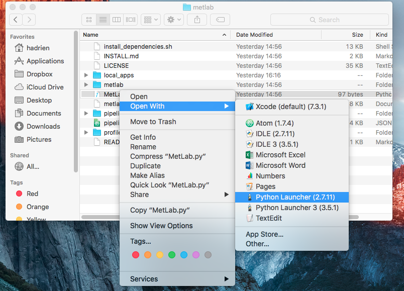
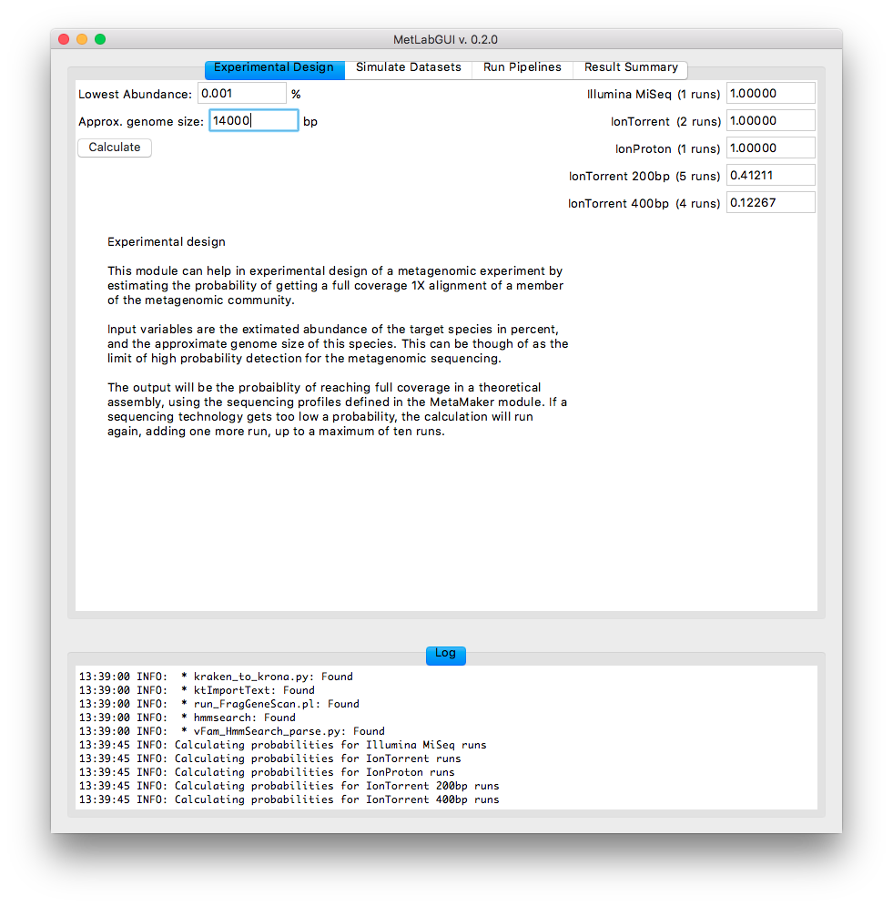
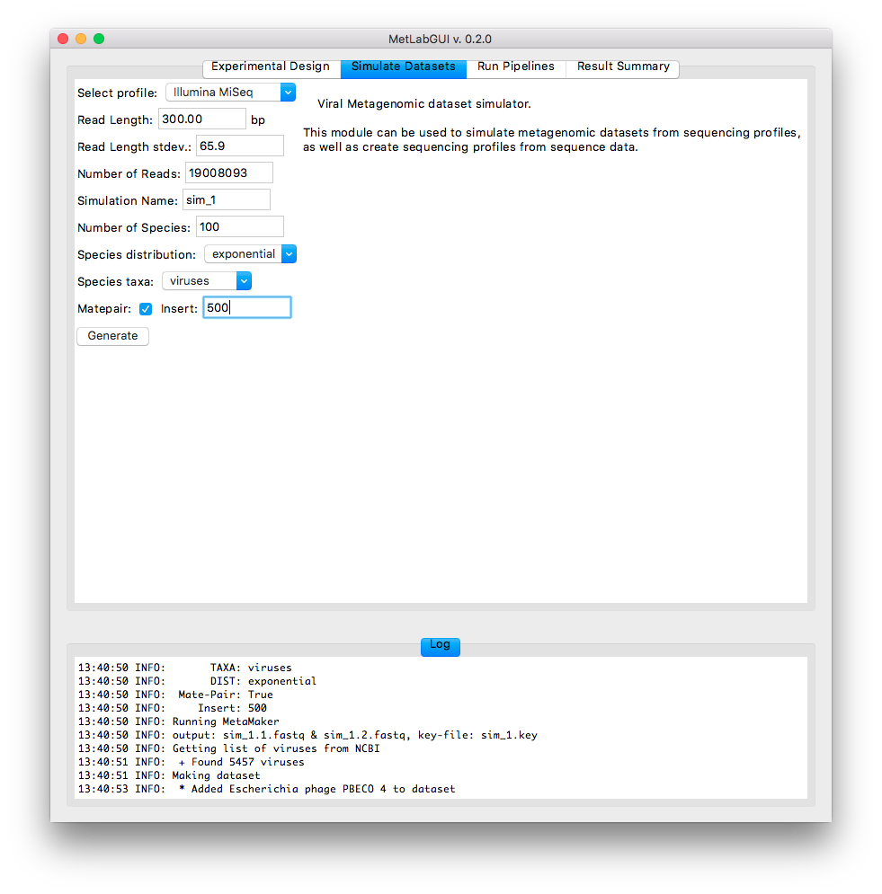
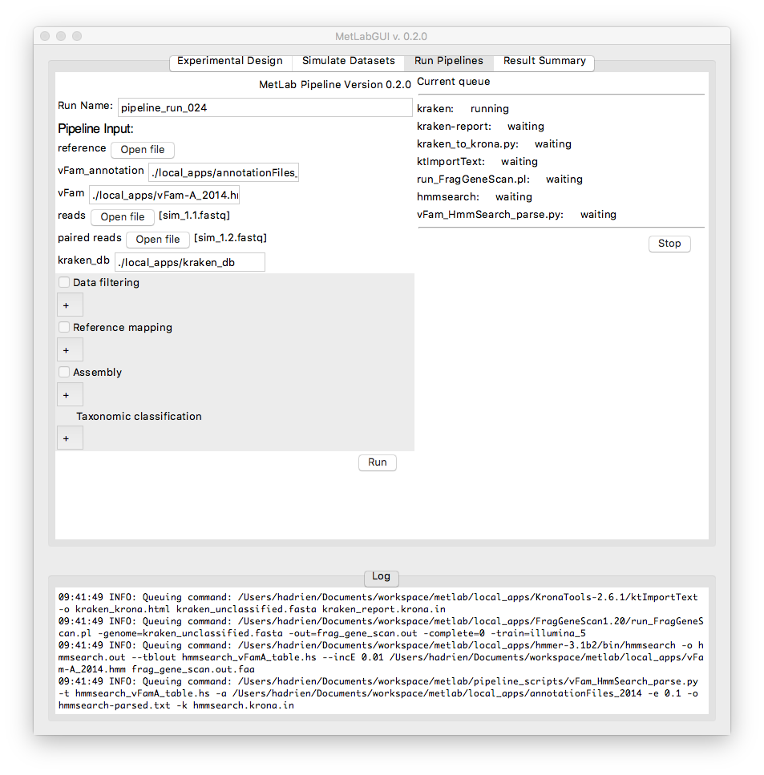

# MetLab
MetLab - Metagenomics Analysis Pipeline

MetLab is a convenient tool for performing basic metagenomic tasks.
The tool has three distinct parts:

  * Experimental design

    This part of the tool is based on Wendl, et _al._ "Coverage theories for
    metagenomic DNA sequencing based on a generalization of Stevens' theorem"
    (http://www.ncbi.nlm.nih.gov/pubmed/22965653). It can be used to approximate
    the amount of sequencing needed to answer a given metagenomic question.

  * Metagenomic sequencing simulator

    This tool can be used to create a statistical profile from real world
    sequencing data, and may then be used to download random viral genomes and
    create simulated data sets.

  * Metagenomic analysis pipeline

    The main function of the MetLab is to run a metagenomic classification
    pipeline. The pipeline is based on input from NGS sequencing data, and
    can perform data cleaning and pre-processing, host-genome mapping to
    remove contamination, assembly, as well as taxonomic binning.

## Installation

For Installing MetLab, please refer to [INSTALL.md](INSTALL.md)

## USAGE

Start metlab by typing

    ./MetLab.py

in your terminal from the directory where you installed MetLab. It will launch a GUI, with separated tabs for the three distinct modules.

Alternatively, you can launch MetLab from the finder by right clicking on MetLab.py, and select 'open with -> python launcher'

<!--  -->

### Experimental design

The experimental design part of MetLab can be used to approximate the amount of sequencing you need for your project.

From the experimental design tab, simply enter the estimated lowest abundance of the virus you want to detect, and its genome size, then click calculate.

<!--  -->

The module will give you the probability to get a full coverage of 1X for your virus using different sequencing platforms.

### Metagenomic sequencing simulator

This module simulates viral metagenomic datasets from sequencing profiles. It is especially useful if you want to test a new method of classification.

<!--  -->

The module will output one (or two if you selected paired-end read) fastq file(s) and one key file containing the viral composition of your simulated dataset.

### Metagenomic analysis pipeline

This module is the core of MetLab and offers different options to analyse metagenomes

The only mandatory step of the pipeline is the taxonomic classification. MetLab uses [kraken](https://ccb.jhu.edu/software/kraken/) and a combination of [fraggenescan](http://omics.informatics.indiana.edu/FragGeneScan/), [hmmer](http://hmmer.org) and [vFam](http://derisilab.ucsf.edu/software/vFam/) to assign taxonomic information to reads or contigs.

If you want to only assign taxonomic information to your data and skip the quality control and trimming, filtering of the host genome and assembly steps, untick the 'Data filtering', 'Reference mapping' and 'Assembly' boxes, upload your reads and click 'run'

<!--  -->

By default, the standard kraken database is used. If you wish to use our custom database (which we highly recommend!), please refer to [INSTALL.md](INSTALL.md)

In the ouput directory, you can find Krona charts describing both the classification by kraken and by hmmer.
